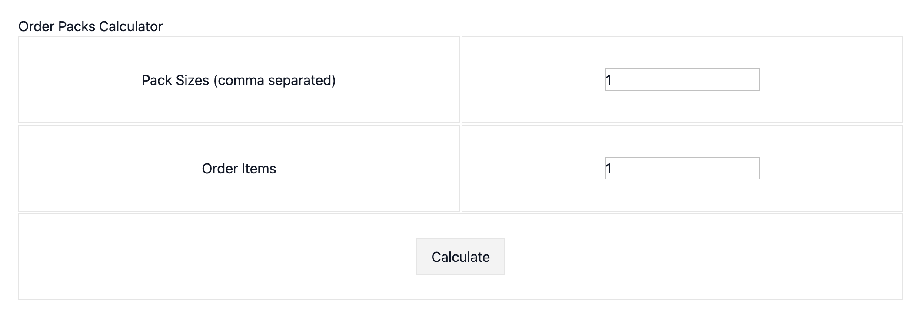

# Order Packs Calculator

This project provides a simple web application for calculating optimal order packs to fulfill customer orders.
It allows users to specify available pack sizes and the number of items to order, and the application calculates
the minimum number of packs needed for each size.

## Features

* Calculates the optimal order packs to minimize the total number of packs used.
* Prioritizes larger pack sizes to reduce overall pack count.
* Provides a simple web interface for inputting order details.

### Prerequisites

* Go 1.23 or later
* Docker

### Building and Running with Docker

1. **Clone the repository:**
   ```bash
   git clone https://github.com/Elkelany/re_partners_software_coding_challenge_go.git
   cd re_partners_software_coding_challenge_go
   ```

2. **Build the Docker image:**
   ```bash
   docker build . -t re_partners_software_coding_challenge_go
   ```

3. **Run the Docker container:**
   ```bash
   docker run --rm --name re_partners_software_coding_challenge_go --publish 8088:8088 re_partners_software_coding_challenge_go
   ```
   This will start the application and map port 8088 on your host machine to port 8088 in the container.

4. **Access the application:** Open your web browser and navigate to http://localhost:8088, you should be able to see the application.
   

### Building and Running Locally (Alternative)

1. **Clone the repository:** Same as above

2. **Build the application:**
   ```bash
   go build -o bin/re_partners_software_coding_challenge_go ./cmd/api
   ```

3. **Run the application:**
   ```bash
   ./bin/re_partners_software_coding_challenge_go
   ```
   This will start the application on port 8088.


4. **Access the application:** Open your web browser and navigate to http://localhost:8088.

## How to Use

1. Open the application in your web browser.
2. Enter the available pack sizes, separated by commas (e.g., 250, 500, 1000, 2000, 5000).
3. Enter the number of items to order.
4. Click the "Calculate" button.
5. The application will display the optimal order packs, showing the number of packs needed for each pack size.

## Project Structure
    re_partners_software_coding_challenge_go/
    ├── cmd/
    │   └── api/                 # Main application entry point
    │   └── internal/        
    │       ├── orderpacks/      # Business logic and use cases
    │       └── handlers/        # HTTP handlers
    ├── static/                  # Static files (HTML template)
    ├── go.mod                   # Go module file
    ├── go.sum                   # Go checksum file
    ├── Dockerfile               # Dockerfile for containerization
    └── README.md                # This file
